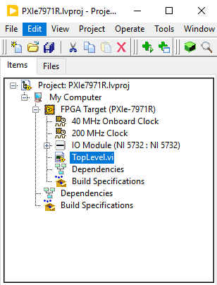
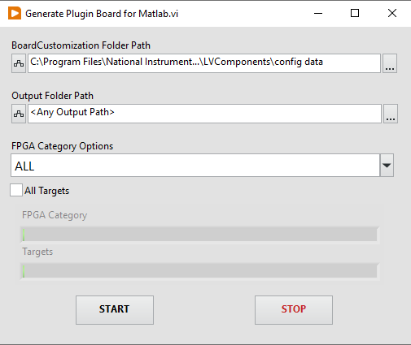

# Support for adaptable IO using reference design

- This example illustrates how to use a FlexRIO FPGA with an adaptable IO Module using custom Reference Design.

## Steps to use the example

- Add **FlexRIOFPGAModules** to the matlab search path
- Copy "PXIe-7971R.json" to "C:\Program Files\National Instruments\IP to FPGA Conversion Utility\LVComponents\config data"

Note: Refer the section below for details on the PXIe-7971.json and the files plugin_board under FlexRIOFPGAModules folder.

## Create Board Customization JSON

- To add support for targets to IP to FPGA Conversion Utility, add board customization JSON and place it in "C:\Program Files\National Instruments\IP to FPGA Conversion Utility\LVComponents\config data"
  Refer [readme](https://www.ni.com/docs/en-US/bundle/ip-to-fpga-conversion-utility/page/creating-reference-designs.html#d361e58) for more information regarding Board Customization JSON.
- To support adaptable IO add all the respective board IO information in BoardIO section of the JSON as shown below.

```json
"BoardIOData": [
            {
                "Name": "IO Module\\AI $i",
                "Direction": "input",
                "LoopComponent": [
                    {
                        "name": "i",
                        "value": "[0- 1]"
                    }
                ],
                "Datatype": "U16",
                "StructureLabel": "AI Read Loop",
                "Args": "",
                "CoupledIO": "",
                "InvokeNodes": [],
                "PropertyNodes": []
            },
            .
            .
            .
]
```

## Reference Project

- Create an template reference project for the target using "create-template" command.
- Add all the required structures necessary accordance to the target's Board Customization JSON present in "C:\Program Files\National Instruments\IP to FPGA Conversion Utility\LVComponents\config data".
- Add the IO module to the respective target.



For the example we have used Adaptable module 5732, and configured project is placed at "FlexRIOFPGAModules\+PXIe7971R\+AdaptableIOSupport\PXIe7971R.lvproj"

## Registering a Custom Board

- After copying the Board Customization JSON in "C:\Program Files\National Instruments\IP to FPGA Conversion Utility\LVComponents\config data", We can use the PluginBoardGenerationTool to generate all the files related to matlab.
- Open "C:\Program Files\National Instruments\IP to FPGA Conversion Utility\PluginBoardGenerationTool\Generate Plugin Board for Matlab.vi"
- Provide input to the VIs as illustrated in the image below:



- Add the output to the matlab search path.

  `set path > Add Folder > selected the folder`

## Register reference design

- Create an reference design with the above mentioned project as the custom Labview Design

```json
hRD.addCustomLabviewDesign('LabviewProject', '<Path to labview project>')
```
