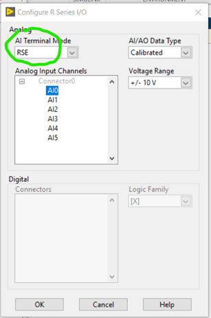
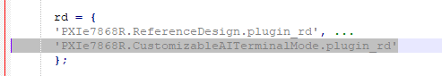
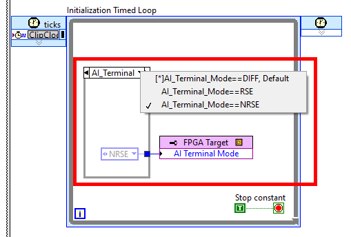
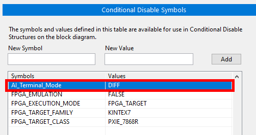

# Supporting multiple IO Configuration types using reference Design.

This example illustrates the usage of a basic parameterized reference design to adjust the AI Terminal Mode on an R Series PXIe-7868R.



## Steps to use the example

- Copy the "+AdaptableIOConfigurations" folder to `<Matlab toolbox installation location>\hdlsupport\Rseries\+PXIe7868R`
- Register the reference design in the respective "hdlcoder_ref_design_customization.m" file.
  - open the `hdlcoder_ref_design_customization.m` file from `<Matlab toolbox installation location>\hdlsupport\Rseries\+PXIe7868R`
  - add `'PXIe7868R.AdaptableIOConfigurations.plugin_rd'` in rd section as shown below,

  

## Reference Project

- The reference project can be found under `+CustomizableAITerminalMode` folder. This was created using ip2fpgacli create-template `ip2fpgaCLI.exe create-template –t PXIe-7971R -o <FolderPathToSaveTemplate>` on a windows command line console. This was then edited to include extra code shown below.



- The same `conditional symbols` are configured under target properties as shown below.



## Register reference design

- The reference design registration file can be found [here](+CustomizableAITerminalMode\plugin_rd.m). the AI_Terminal_Mode parameter has been exposed to HDL Coder in the lines shown below.
- add Parameter in the reference design to allow the user to update Conditional Symbols in Task 1.2

```json
hRD.addParameter('ParameterID'    ,  'Customizable_AI_Terminal_Mode', ...
                     'DisplayName'    ,  'Customizable_AI_Terminal_Mode', ...
                     'DefaultValue'   ,  'DIFF',...
                     'ParameterType'  ,   hdlcoder.ParameterType.Dropdown, ...
                     'Choice'         ,   {'DIFF','NRSE','RSE'});
```
