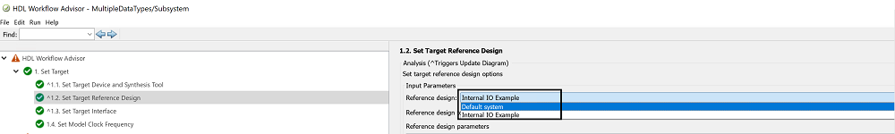
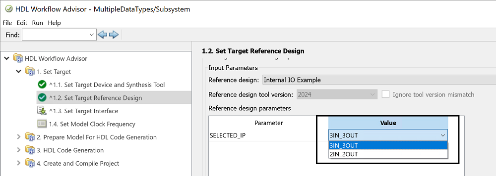
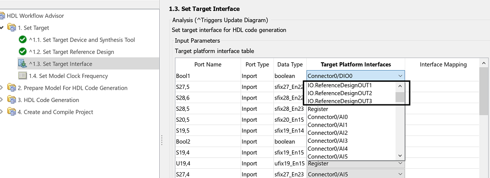
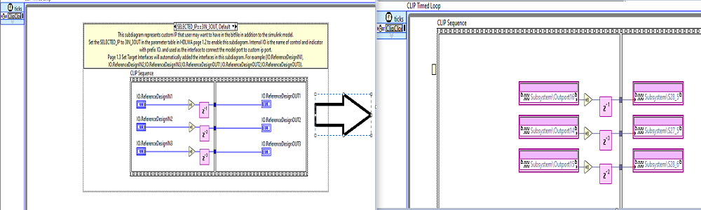

# Internal IO

- This example illustrates
    - How to create a bitfile that contains additional customizable IP alongside a Simulink model using a LabVIEW project that contains the additional IP as a Reference Design in NI Bitfile Generation Workflow.
    - Customizing the additional IP using Parameters table.
    - Connecting the model ports to the IP ports in Set Target Interfaces.

# Steps to use the Example

- Copy the `+InternalIOExample` folder to `<Matlab toolbox installation location>\hdlsupport\Rseries\+PXIe7867R`.
- Replace the `hdlcoder_ref_design_customization.m` file located at `<Matlab toolbox installation location>\hdlsupport\Rseries\hdlcoder_ref_design_customization.m`.

## HDL Workflow Advisor Overview

- In Task 1.2, for Reference Design select **Internal IO Example** from the dropdown menu.



- The Reference Design Parameter section allows you to select a custom IP from the list of registered options.



- In Task 1.3, the interfaces of your selected custom IP are listed along with the available board I/O interfaces.



- These interfaces will be substituted with Model Port CLIP Nodes in the final project.




## Reference Project
- The reference project can be found under `+InternalIOExample` folder.
- This was created using `create-template` command `ip2fpgaCLI.exe create-template –t PXIe-7971R -o <FolderPathToSaveTemplate>` on a windows command line console. This was then edited to include custom IP shown below.

  

- The same `conditional symbols` are configured under target properties as shown below.

  


## Register a reference Design.

- The reference design registration file can be found `+InternalIOExample\plugin_rd.m`.

```
hRD.ReferenceDesignName = 'Internal IO Example';
```
- ReferenceDesignName specifies the name of the reference design `InternalIOExample`. It is unique for each refernce design.

```
hRD.addCustomLabviewDesign('LabviewProject','PXIe-7867R.lvproj');
```
- The LabviewProject parameter connects to the LabVIEW FPGA project you created using the create-template command and subsequently modified.

```
hRD.addParameter('ParameterID'    ,  'SELECTED_IP', ...
                     'DisplayName'    ,  'SELECTED_IP', ...
                     'DefaultValue'   ,  '3IN_3OUT',...
                     'ParameterType'  ,   hdlcoder.ParameterType.Dropdown, ...
                     'Choice'         ,   {'3IN_3OUT','2IN_2OUT'});
end
```
- The ParameterID serves as a unique identifier for the parameter (SELECTED_IP), which corresponds to the conditional symbols used in LabVIEW to configuration custom IP.
- hdlcoder.ParameterType.Dropdown indicates a dropdown menu for parameter value in Task 1.2..
- The Choice parameter specifies the dropdown options ({'3IN_3OUT', '2IN_2OUT'}), representing configurations with either 3 inputs and 3 outputs or 2 inputs and 2 outputs.

```
     rd = {
      'PXIe7867R.ReferenceDesign.plugin_rd', ...
      'PXIe7867R.InternalIOExample.plugin_rd'
      };

      boardName = 'PXIe-7867R';
```

- The function hdlcoder_ref_design_customization registers reference designs and their associated board names, allowing HDL Workflow Advisor to populate reference design options for each board. `hdlcoder_ref_design_customization.m` file can be found `InternalIOExample\RSeries\+PXIe7867R`.

